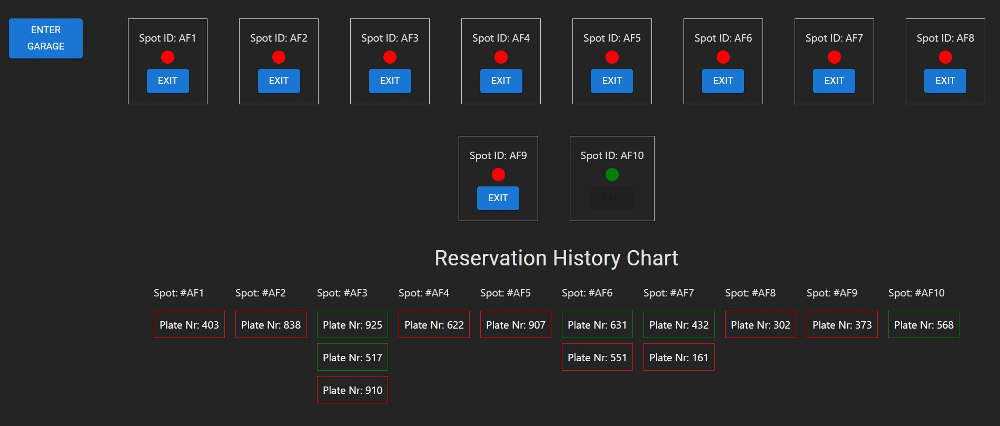

# Smart Parking

This is a React application for a parking garage reservation system. It allows users to enter and exit the garage, assigns available parking spots, and displays the reservation history.

## Features

- Simulate entering and exiting the garage
- Automatic assignment of parking spots to drivers
- Display of reservation history for the entire parking lot

## Technologies Used

- vite.js
- React
- TypeScript
- CSS (styled-components and Material-UI)

## Installation

1. Clone the repository:

   ```bash
   git clone https://github.com/iamishraqhc/0855ea2b-1f52-4d26-b729-821ceed1ca96.git
   ```

2. Navigate to the project directory:

   ```bash
   cd 0855ea2b-1f52-4d26-b729-821ceed1ca96
   ```

3. Install the dependencies:

   ```bash
   npm install
   ```

4. Start the development server:

   ```bash
   npm run dev
   ```

   The application will be available at `http://localhost:5173`.

## Usage

- Click the "Enter Garage" button to simulate a driver entering the garage.
- Available parking spots will be assigned automatically to drivers.
- Click the respective "Exit" button from a parking spot to leave that specific spot.
- The reservation history for the entire parking lot will be displayed.

## A sample overview


